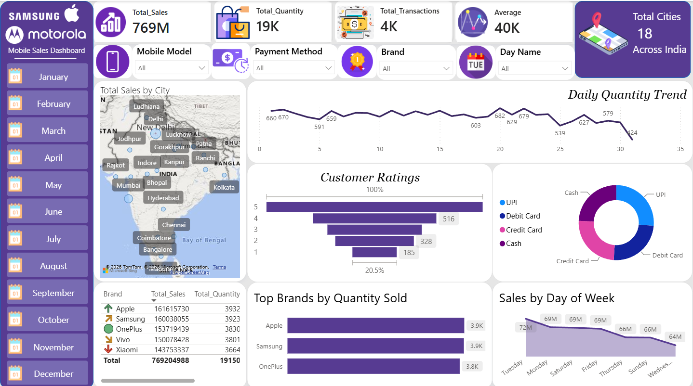
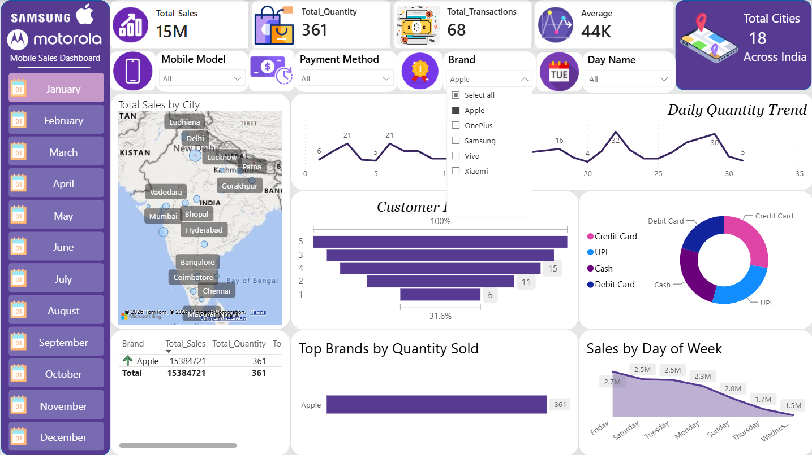
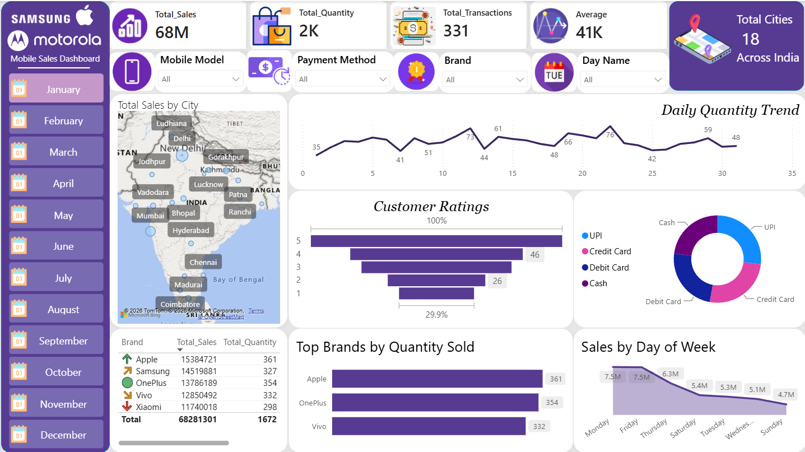
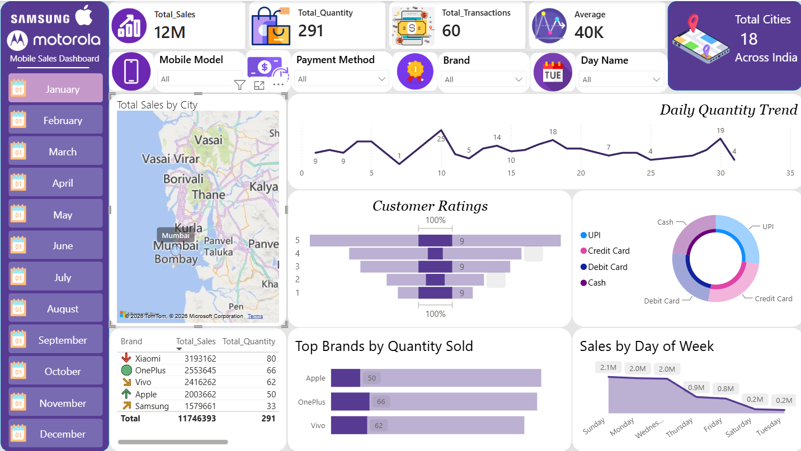

# 📱 Mobile Sales Analytics Dashboard

## 📌 Overview

This project is an interactive Power BI dashboard developed to analyze mobile phone sales data. The dashboard provides insights into sales performance, customer ratings, transactions, payment methods, brand performance, and city-wise sales through interactive visualizations.

---

## 🛠️ Tools & Technologies

- Power BI
- Power Query
- DAX
- Microsoft Excel

---

## 📊 Dashboard Preview

---

## ✨ Key Features

- Interactive Dashboard
- KPI Cards
- Dynamic Slicers
- Map Visualization
- Brand-wise Sales Analysis
- Payment Method Analysis
- Customer Rating Analysis
- Daily Sales Trend
## 📈 Key Performance Indicators (KPIs)

- Total Sales
- Total Quantity Sold
- Total Transactions
- Average Sales
- Cities Covered

---

## 📸 Dashboard Screenshots

### apple Filter

### January Filter

### City Analysis

---

## 💡 Business Insights

- Identified top-performing mobile brands.
- Analyzed city-wise sales performance.
- Compared payment method preferences.
- Tracked customer rating distribution.
- Monitored daily sales trends.

---

## 👨‍💻 Author

**Vishal Mandal**

🌐 Portfolio: https://vishalportfolio26.lovable.app/

💼 LinkedIn: https://www.linkedin.com/in/vishal-mandal-83a104379

⭐ If you found this project helpful, please consider giving it a star.
